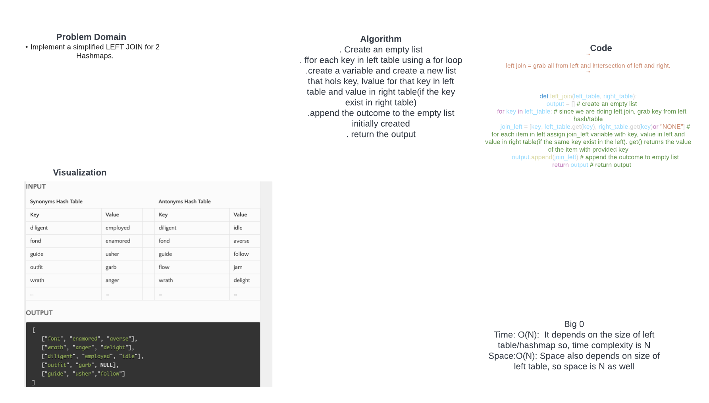

# Hashmap LEFT JOIN
Left join is basically, grab everything on left table and the intersection from the right.

## Challenge
Implement a simplified LEFT JOIN for 2 Hashmaps.

- Write a function called left join
- Arguments: two hash maps
- The first parameter is a hashmap that has word strings as keys, and a synonym of the key as values.
- - The second parameter is a hashmap that has word strings as keys, and antonyms of the key as values.
- Return: The returned data structure that holds the results is up to you. It doesn’t need to exactly match the output below, so long as it achieves the LEFT JOIN logic

## Approach & Efficiency
. Create an empty list
. ffor each key in left table using a for loop
.create a variable and create a new list that hols key, lvalue for that key in left table and value in right table(if the key exist in right table)
.append the outcome to the empty list initially created
. return the output

Big 0
- Time: O(N):  It depends on the size of left table/hashmap so, time complexity is N
- Space:O(N): Space also depends on size of left table, so space is N as well

## Solution

