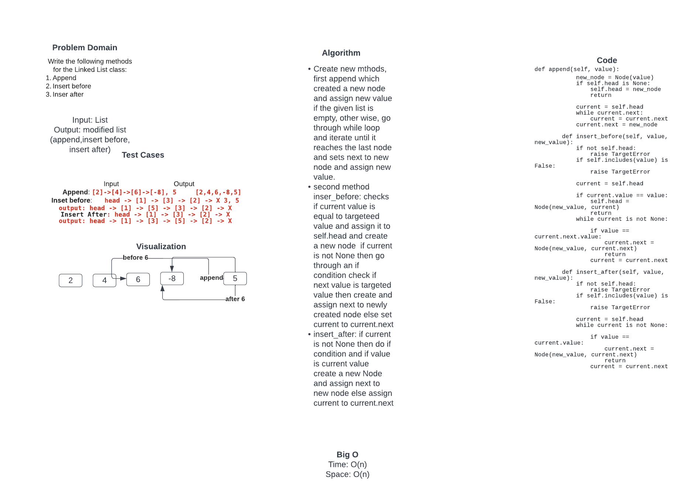

# Challenge Summary
Write the following methods for the Linked List class:
. append
arguments: new value
adds a new node with the given value to the end of the list

. insert before
arguments: value, new value
adds a new node with the given new value immediately before the first node that has the value specified

. insert after
arguments: value, new value
adds a new node with the given new value immediately after the first node that has the value specified

## Whiteboard Process

## Approach & Efficiency
Append: crate a new node and pass value to new node. Check if current head is none if it is create a new node and assign new value. if current.next is true then assign current to current.next, once it reaches the last node create a new node and assign value to the newly created last node

Insert before: check if current value is equal to targeted value, if it is then create a new node and assign current to new node. If current node is not none then go through while loop and check if targeted value os equal to next value if it is then create a new node and pass current.next else set current to next.

Insert after:
set current to self.head. go through while loop while current is not none, check if value is equal to current then create new node and assign next to the newly created node. else set current to next.

## Solution
def append(self, value):
        new_node = Node(value)
        if self.head is None:
            self.head = new_node
            return

        current = self.head
        while current.next:
            current = current.next
        current.next = new_node

    def insert_before(self, value, new_value):
        if not self.head:
            raise TargetError
        if self.includes(value) is False:
            raise TargetError

        current = self.head

        if current.value == value:
            self.head = Node(new_value, current)
            return
        while current is not None:

            if value == current.next.value:
                current.next = Node(new_value, current.next)
                return
            current = current.next

    def insert_after(self, value, new_value):
        if not self.head:
            raise TargetError
        if self.includes(value) is False:
            raise TargetError

        current = self.head
        while current is not None:

            if value == current.value:
                current.next = Node(new_value, current.next)
                return
            current = current.next
