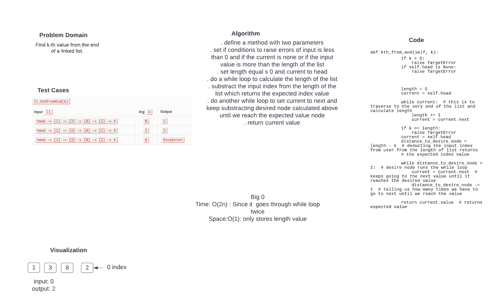

# Challenge Summary
Find k-th value from the end of a linked list.

## Whiteboard Process


## Approach & Efficiency
<!-- What approach did you take? Why? What is the Big O space/time for this approach? -->
I followed the instructions provided and started writing code for each task at a time. Ran the test and see what was failing and resolve that issue.

Big 0:
Time: O(2n) : Since the the moethod I am using is going through two while loops so the time complexity is 2n
Space: O(2): We iterating through each value and only saving value of length and the current value.

## Solution

```
def kth_from_end(self, k):
        if k < 0:
            raise TargetError
        if self.head is None:
            raise TargetError


        length = 0
        current = self.head

        while current:  # this is to traverse to the very end of the list and calculate length
            length += 1
            current = current.next

        if k >= length:
            raise TargetError
        current = self.head
        distance_to_desire_node = length - k  # deducting the input index from user from the length of list returns
        # the expected index value

        while distance_to_desire_node > 1:  # desire node runs the while loop
            current = current.next  # keeps going to the next value until it reaches the desired value
            distance_to_desire_node -= 1  # telling us how many times we have to go to next until we reach the value

        return current.value  # returns expected value
        ```


