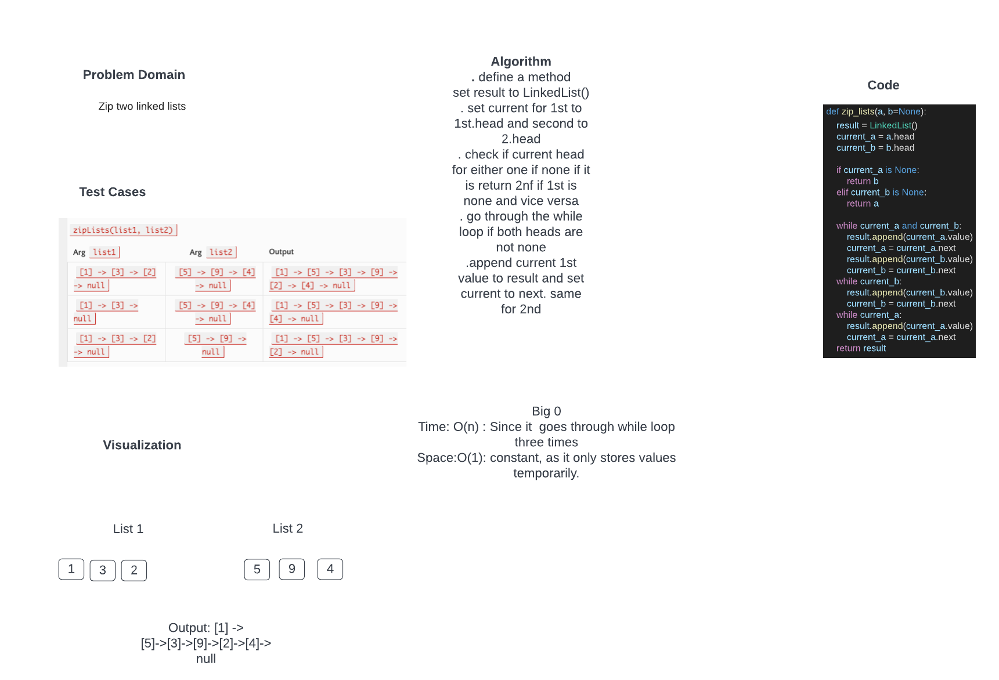

# Challenge Summary
. Write a function called zip lists
. Arguments: 2 linked lists
. Return: New Linked List, zipped as noted below
. Zip the two linked lists together into one so that the nodes alternate between the two lists and return a reference to the the zipped list.
. Try and keep additional space down to O(1)
. You have access to the Node class and all the properties on the Linked List class as well as the methods created in previous challenges.

## Whiteboard Process

## Approach & Efficiency
Two lists were given. First thing was to check if the lists provided are empty and if 1st is empty return the other one. now if both are not empty then going through the while I appended the value to result and then set current to next. Another corner case was if one if empty and other one is not. in that case go through while loop and append value to result and then return result.

Big O
Time : O(n) as it goes through while loop three times. and it is not a nested loop
Space: contant as it only stores values temporarily

## Solution
def zip_lists(a, b=None):
    result = LinkedList()
    current_a = a.head
    current_b = b.head

    if current_a is None:
        return b
    elif current_b is None:
        return a

    while current_a and current_b:
        result.append(current_a.value)
        current_a = current_a.next
        result.append(current_b.value)
        current_b = current_b.next
    while current_b:
        result.append(current_b.value)
        current_b = current_b.next
    while current_a:
        result.append(current_a.value)
        current_a = current_a.next
    return result
