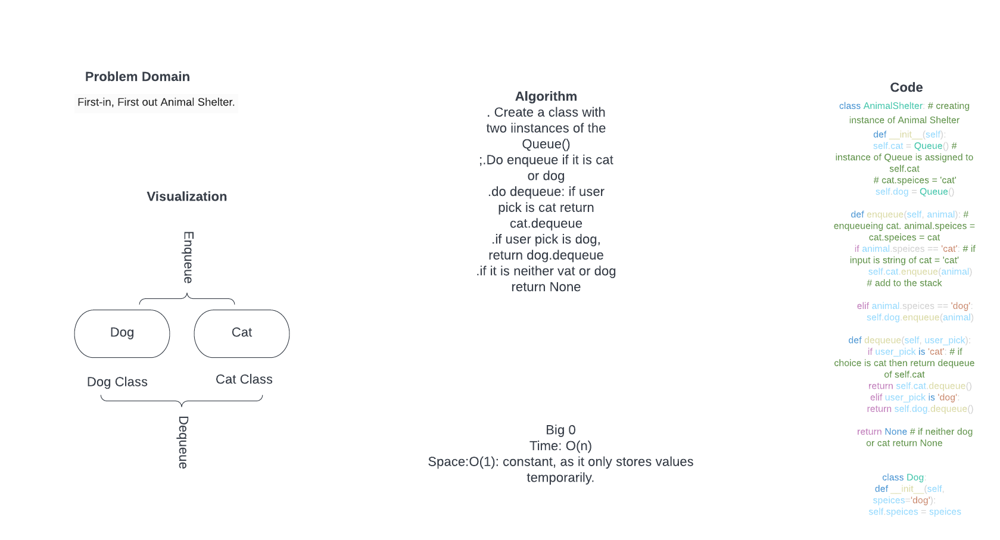

# Challenge Summary
Create a class called AnimalShelter which holds only dogs and cats.
The shelter operates using a first-in, first-out approach.
Implement the following methods:
    . enqueue
      . Arguments: animal
        . animal can be either a dog or a cat object.
    . dequeu
      . Arguments: pref
        . pref can be either "dog" or "cat"
      . Return: either a dog or a cat, based on preference.
        . If pref is not "dog" or "cat" then return null.

## Whiteboard Process

## Approach & Efficiency

. Create a class with two iinstances of the Queue()
.Do enqueue if it is cat or dog
.do dequeue: if user pick is cat return cat.dequeue
.if user pick is dog, return dog.dequeue
.if it is neither vat or dog return None

Big O
Time : O(n) , time complexity is constant as we are iterating through a nested loop and only going through the stack regardless of the length
Space: Contant as it only stores value temporarily

## Solution
class AnimalShelter: # creating instance of Animal Shelter
    def __init__(self):
        self.cat = Queue() # instance of Queue is assigned to self.cat
        # cat.speices = 'cat'
        self.dog = Queue()

    def enqueue(self, animal): # enqueueing cat. animal.speices = cat.speices = cat
        if animal.speices == 'cat': # if input is string of cat = 'cat'
            self.cat.enqueue(animal) # add to the stack

        elif animal.speices == 'dog':
            self.dog.enqueue(animal)

    def dequeue(self, user_pick):
        if user_pick is 'cat': # if choice is cat then return dequeue of self.cat
            return self.cat.dequeue()
        elif user_pick is 'dog':
            return self.dog.dequeue()

        return None # if neither dog or cat return None

class Dog:
    def __init__(self, speices='dog'):
        self.speices = speices

class Cat:
    def __init__(self, speices='cat'): # creating instance of Cat with speices equals to cat
        self.speices = speices

