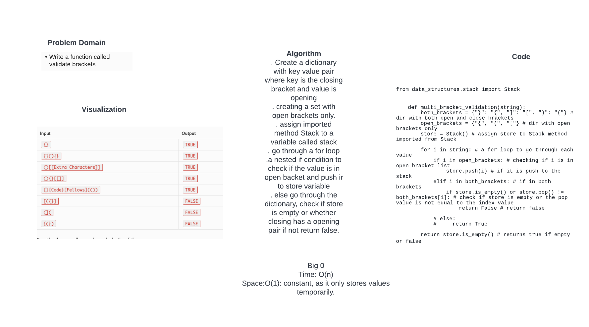

# Challenge Summary
Write a function called validate brackets
Arguments: string
Return: boolean
representing whether or not the brackets in the string are balanced

## Whiteboard Process

## Approach & Efficiency

. Create a dictionary with key value pair where key is the closing bracket and value is opening
. creating a set with open brackets only.
. assign imported method Stack to a variable called stack
. go through a for loop
.a nested if condition to check if the value is in open backet and push ir to store variable
. else go through the dictionary, check if store is empty or whether closing has a opening pair if not return false.

Big 0
Time: O(n)
Space:O(1): constant, as it only stores values temporarily.

## Solution
from data_structures.stack import Stack

def multi_bracket_validation(string):
    both_brackets = {"}": "{", "]": "[", ")": "("} # dir with both open and close brackets
    open_brackets = {"{", "(", "["} # dir with open brackets only
    store = Stack() # assign store to Stack method imported from Stack

    for i in string: # a for loop to go through each value
        if i in open_brackets: # checking if i is in open bracket list
            store.push(i) # if it is push to the stack
        elif i in both_brackets: # if in both brackets
            if store.is_empty() or store.pop() != both_brackets[i]: # check if store is empty or the pop value is not equal to the index value
                return False # return false

        # else:
        #     return True

    return store.is_empty() # returns true if empty or false
