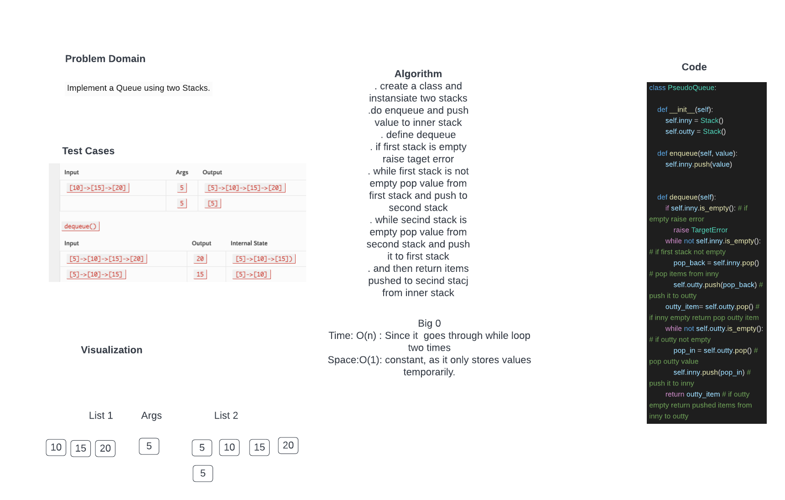

# Challenge Summary
Create a new class called pseudo queue.
Do not use an existing Queue.
Instead, this PseudoQueue class will implement our standard queue interface (the two methods listed below),
Internally, utilize 2 Stack instances to create and manage the queue
Methods:
enqueue
Arguments: value
Inserts value into the PseudoQueue, using a first-in, first-out approach.
dequeue
Arguments: none
Extracts a value from the PseudoQueue, using a first-in, first-out approach

## Whiteboard Process

## Approach & Efficiency
Defined two variables calling stack method. Check if first stack is empty and raise target error. If first stack is not empty then pop value from first stack and push to secind stack. while second stack is empty , pop value from second stack and push it to first stack.else return pushed value to second stack from first stack.

Big 0
Time: O(n) : Since it  goes through while loop two times
Space:O(1): constant, as it only stores values temporarily.

## Solution
class PseudoQueue:

    def __init__(self):
        self.inny = Stack()
        self.outty = Stack()

    def enqueue(self, value):
        self.inny.push(value)

    def dequeue(self):
        if self.inny.is_empty(): # if empty raise error
            raise TargetError
        while not self.inny.is_empty(): # if first stack not empty
            pop_back = self.inny.pop() # pop items from inny
            self.outty.push(pop_back) # push it to outty
        outty_item= self.outty.pop() # if inny empty return pop outty item
        while not self.outty.is_empty(): # if outty not empty
            pop_in = self.outty.pop() # pop outty value
            self.inny.push(pop_in) # push it to inny
        return outty_item # if outty empty return pushed items from inny to outty
