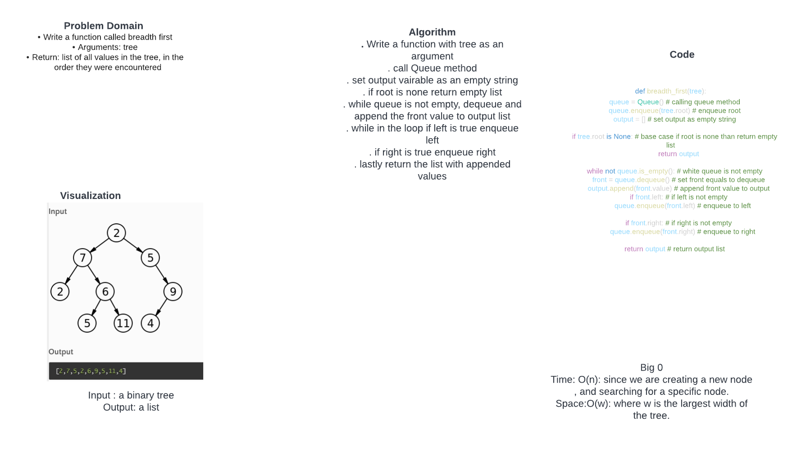

# Challenge Summary
. Write a function called breadth first
. Arguments: tree
. Return: list of all values in the tree, in the order they were encountered

## Whiteboard Process

## Approach & Efficiency
. Write a function with tree as an argument
. call Queue method
. set output vairable as an empty string
. if root is none return empty list
. while queue is not empty, dequeue and append the front value to output list
. while in the loop if left is true enqueue left
. if right is true enqueue right
. lastly return the list with appended values

Big 0
. Time: O(n): since we are creating a new node , and searching for a specific node.
. Space:O(w): where w is the largest width of the tree.

## Solution
def breadth_first(tree):
    queue = Queue() # calling queue method
    queue.enqueue(tree.root) # enqueue root
    output = [] # set output as empty string

    if tree.root is None: # base case if root is none than return empty list
        return output

    while not queue.is_empty(): # white queue is not empty
        front = queue.dequeue() # set front equals to dequeue
        output.append(front.value) # append front value to output
        if front.left: # if left is not empty
            queue.enqueue(front.left) # enqueue to left

        if front.right: # if right is not empty
            queue.enqueue(front.right) # enqueue to right

    return output # return output list
