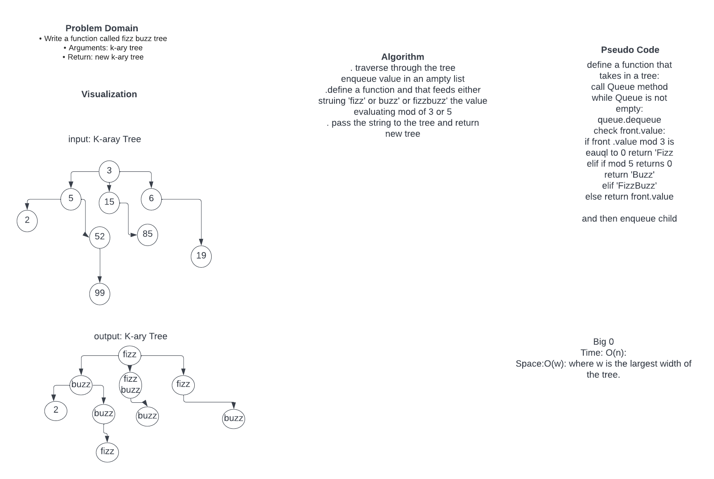

# Challenge Summary
Write a function called fizz buzz tree
Arguments: k-ary tree
Return: new k-ary tree
Determine whether or not the value of each node is divisible by 3, 5 or both. Create a new tree with the same structure as the original, but the values modified as follows:

If the value is divisible by 3, replace the value with “Fizz”
If the value is divisible by 5, replace the value with “Buzz”
If the value is divisible by 3 and 5, replace the value with “FizzBuzz”
If the value is not divisible by 3 or 5, simply turn the number into a String.

## Whiteboard Process

## Approach & Efficiency
. traverse through the tree
enqueue value in an ampty list
.define a function and that feeds either struing 'fizz' or buzz' or fizzbuzz' the value evaluating mod of 3 or 5
. pass the string to the tree and return new tree

Big 0
Time: O(n):
Space:O(w): where w is the largest width of the tree.

## Solution

# Pseudo Code
define a function that takes in a tree:
call Queue method
while Queue is not empty:
queue.dequeue
check front.value:
if front .value mod 3 is eauql to 0 return 'Fizz
elif if mod 5 returns 0 return 'Buzz'
elif 'FizzBuzz'
else return front.value

and then enqueue child

