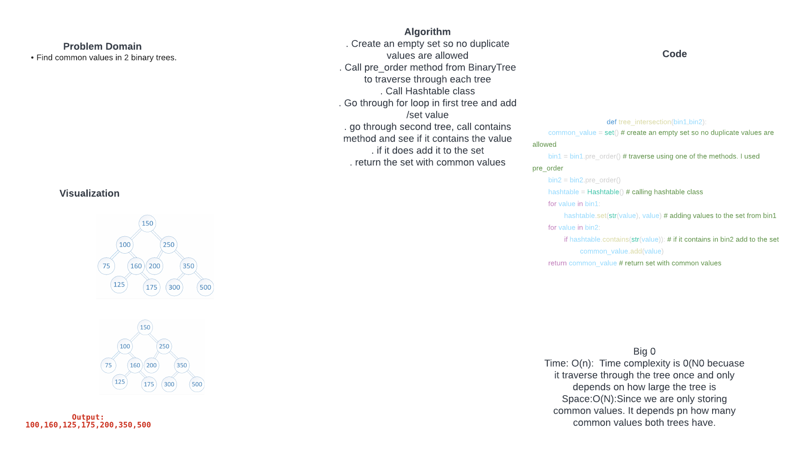

# Challenge Summary
Find common values in 2 binary trees.

## Whiteboard Process

## Approach & Efficiency
. Create an empty set so no duplicate values are allowed
. Call pre_order method from BinaryTree to traverse through each tree
. Call Hashtable class
. Go through for loop in first tree and add /set value
. go through second tree, call contains method and see if it contains the value
. if it does add it to the set
. return the set with common values

Big 0
- Time: O(n):  Time complexity is 0(N0 becuase it traverse through the tree once and only depends on how large the tree is
- Space:O(N):Since we are only storing common values. It depends pn how many common values both trees have.

## Solution

def tree_intersection(bin1,bin2):
        common_value = set() # create an empty set so no duplicate values are allowed
        bin1 = bin1.pre_order() # traverse using one of the methods. I used pre_order
        bin2 = bin2.pre_order()
        hashtable = Hashtable() # calling hashtable class
        for value in bin1:
                hashtable.set(str(value), value) # adding values to the set from bin1
        for value in bin2:
                if hashtable.contains(str(value)): # if it contains in bin2 add to the set
                        common_value.add(value)
        return common_value # return set with common values
