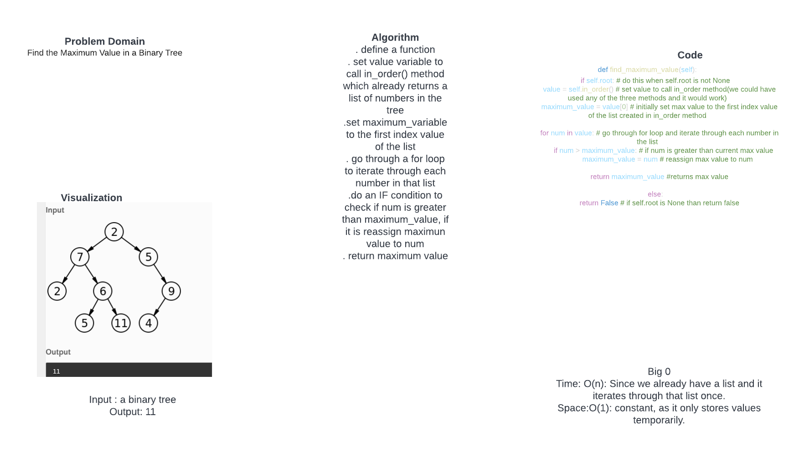

# Challenge Summary
Provided a Binary tree, find the maximun value in the Tree

## Whiteboard Process

## Approach & Efficiency

. define a function
. set value variable to call in_order() method which already returns a list of numbers in the tree
.set maximum_variable to the first index value of the list
. go through a for loop to iterate through each number in that list
.do an IF condition to check if num is greater than maximum_value, if it is reassign maximun value to num
. return maximum value
. I added a few extra tests to make sure the solution is covering all cases as well.

Big 0
. Time: O(n): Since we already have a list and it iterates through that list once.
. Space:O(1): constant, as it only stores values temporarily.

## Solution
def find_maximum_value(self):
        if self.root: # do this when self.root is not None
            value = self.in_order() # set value to call in_order method(we could have used any of the three methods and it would work)
            maximum_value = value[0] # initially set max value to the first index value of the list created in in_order method

            for num in value: # go through for loop and iterate through each number in the list
                if num > maximum_value: # if num is greater than current max value
                    maximum_value = num # reassign max value to num
            return maximum_value #returns max value
        else:
            return False # if self.root is None than return false
